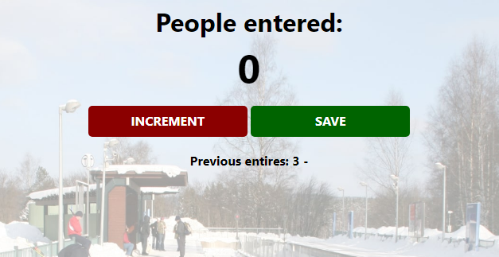

# freeCodeCamp - Subway People Counter

Vidéo (parti 1) [freeCodeCamp - JavaScript Programming (Full Course)](https://youtu.be/jS4aFq5-91M) utilisé pour réaliser cet exercice

## Fonctionnalités

- Possibilité d'incrémenter le nombre de personnes dans le métro
- Sauvegarder le nombre présent dans le métro
- Ré-incrémenter une nouvelle valeur de personne dans le rétro (après une station, ou autre métro)
- Historique des saisies

## Rendu

### Page au démarrage

### Page après le nombre de personnes choisi et après avoir cliquer sur "save"

### Page après la nouvelle saisi + historique

